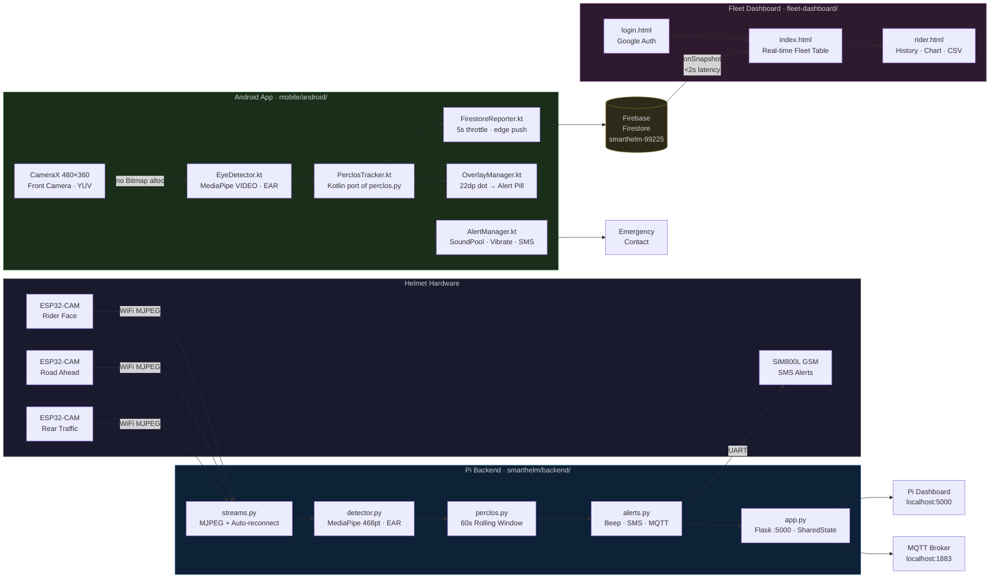

# SmartHelm — System Architecture

---

## Data Flow Summary

| Source | Destination | Protocol | Rate |
|---|---|---|---|
| ESP32-CAM × 3 | Raspberry Pi | WiFi MJPEG | ~25 FPS |
| Pi inference thread | SharedState | in-process lock | per frame |
| Pi alerts | SIM800L | UART | on alert (5-min cooldown) |
| Pi Flask | Browser | HTTP / MJPEG | on request |
| Pi app.py | MQTT broker | MQTT QoS 1 | 2 Hz |
| Android CameraX | EyeDetector | YUV_420_888 | ~25 FPS |
| Android PerclosTracker | FirestoreReporter | in-process | per frame |
| FirestoreReporter | Firestore | HTTPS | 5s normal / immediate on alert |
| Firestore | Fleet Dashboard | WebSocket (onSnapshot) | <2s latency |

## Component Responsibilities

| Component | File(s) | Responsibility |
|---|---|---|
| **Pi backend** | `app.py` | Flask server, inference thread, SharedState |
| | `detector.py` | MediaPipe FaceLandmarker + EAR calculation |
| | `perclos.py` | PERCLOS rolling window + continuous closure |
| | `alerts.py` | Beep (winsound/aplay) + SMS (SIM800L) |
| | `streams.py` | MJPEG auto-reconnect + webcam fallback |
| | `config.py` | Single source of truth for all constants |
| **Android app** | `DetectionService.kt` | LifecycleService, CameraX, thermal throttle |
| | `EyeDetector.kt` | MediaPipe VIDEO mode, no Bitmap allocation |
| | `PerclosTracker.kt` | Kotlin port of perclos.py |
| | `AlertManager.kt` | SoundPool + Vibration + SMS |
| | `OverlayManager.kt` | Floating 22dp dot → alert pill over other apps |
| | `FirestoreReporter.kt` | Smart-throttled Firestore push |
| | `CalibrationActivity.kt` | 100-frame personal EAR baseline |
| **Fleet dashboard** | `app.js` | Firestore onSnapshot, edge-triggered notifications |
| | `rider.js` | Alert history, SVG chart, CSV export |
| | `auth.js` | Firebase Google sign-in |
